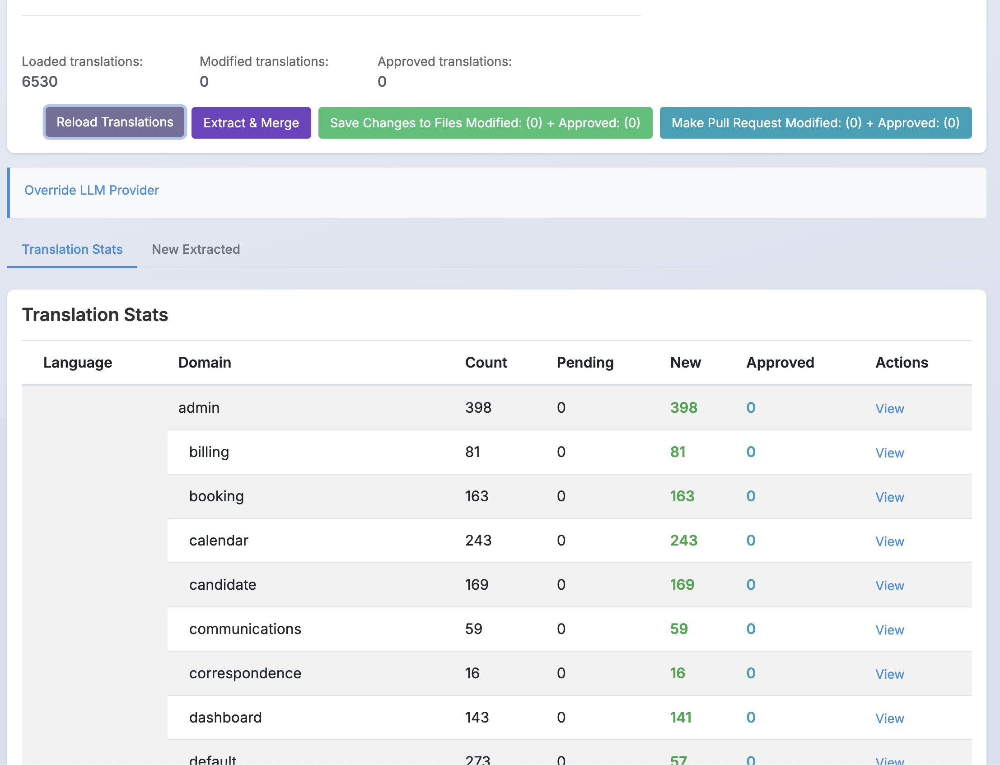
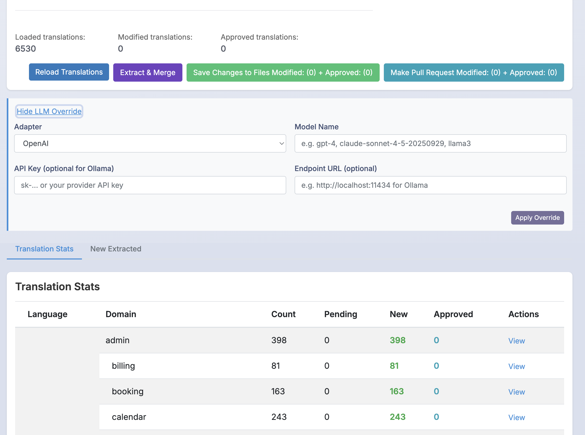
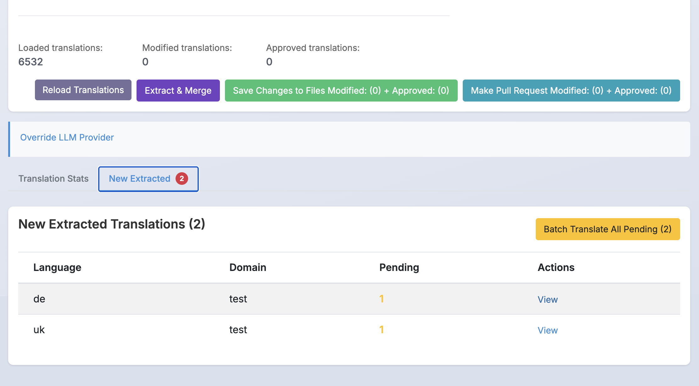
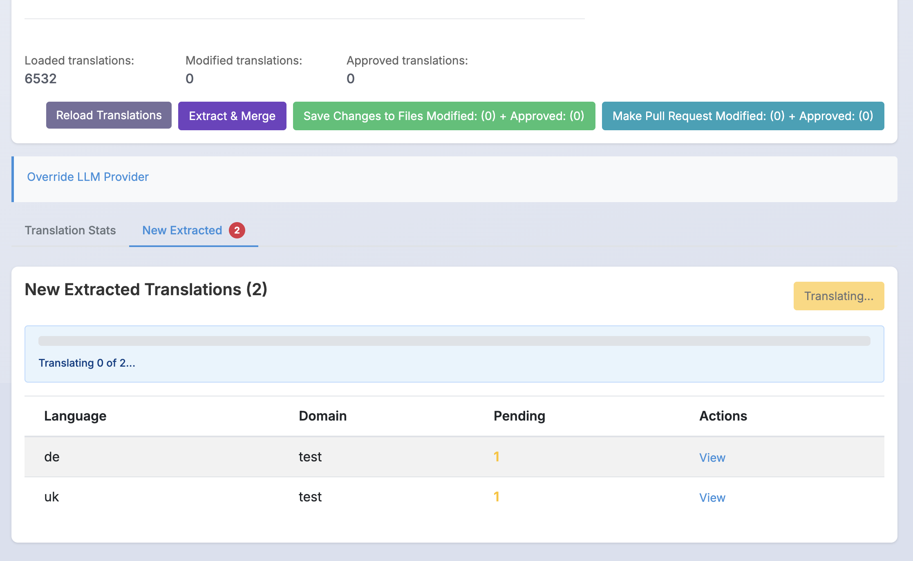
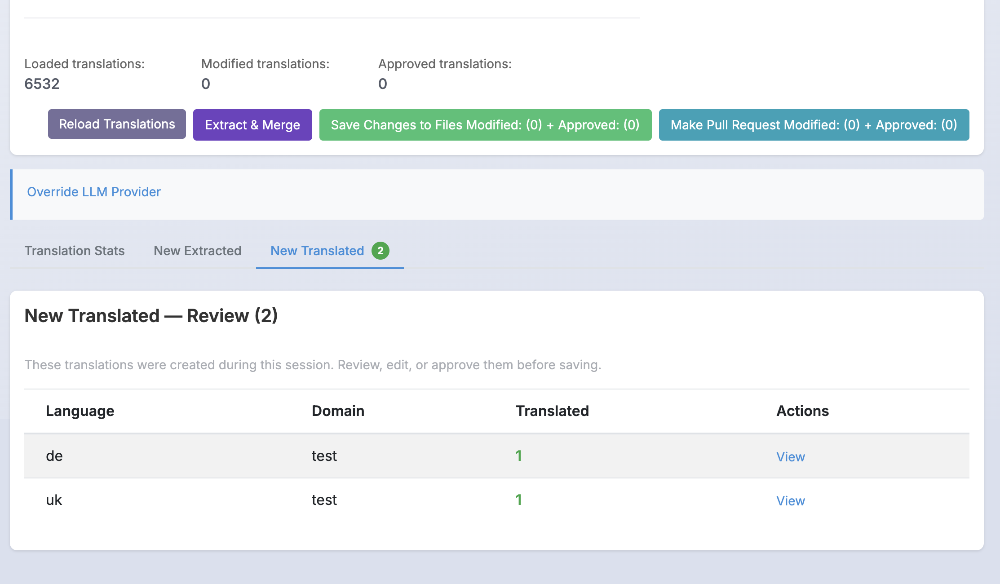

# GettextTranslator

[](https://github.com/marmend-company/gettext_translator/actions/workflows/main.yml)

**GettextTranslator** is a robust translation utility for Elixir projects that leverages advanced AI endpoints to provide high-quality translations. The library seamlessly integrates with Elixir's Gettext, enabling you to maintain the integrity of your application's messages while translating them accurately. It supports multiple AI providers, making it adaptable to your preferred translation service.

**Changelog:** See [CHANGELOG.md](CHANGELOG.md) for detailed changes in each version.  

## Important Note
Observed that regular `:gettext` will create a different structure for the translations than the `GettextTranslator` does. This create a little chaos in the translations while commiting them to the repo. 
Hack to fix it, run you `mix gettext.extract` one more time after translations are done, that will fix the structure and only new translations will be in diff for commit.

## Features

- **Multi-Provider Support:** Easily switch between translation endpoints such as Ollama AI and OpenAI.
- **Customizable Configurations:** Define your own translation persona, style, and languages to ignore.
- **CLI Integration:** Translate Gettext files directly from the command line.
- **Seamless Gettext Integration:** Automatically translate files in your Gettext directory.
- **Live Dashboard:**
  - Monitor and manage translations through Phoenix LiveDashboard
  - Tab-based navigation: Translation Stats, New Extracted, and New Translated views
  - **Extract & Merge** from the dashboard — run `mix gettext.extract --merge` without leaving the browser
  - **Batch Translate** all pending entries with a single click, with real-time progress tracking
  - **LLM Provider Override** — switch AI provider/model per session without changing config files
  - Review, edit, and approve translations with a dedicated post-translation review tab
  - Direct editing of translations with inline LLM translation assistance
  - Save changes back to PO files or create Git PRs directly
- **Production Ready:** Works in both development and release environments with proper path handling.
- **Pluralization Support:** Properly handles language-specific plural forms (including Ukrainian with three forms).

## Dashboard Workflow

The dashboard provides a complete translation management workflow — from extracting new strings, through LLM-powered batch translation, to reviewing and approving results — all without leaving the browser.

### Step 1: Translation Stats Overview

After loading translations, the **Translation Stats** tab shows a summary of all languages and domains with counts, pending items, and changelog status.



### Step 2: Override LLM Provider (Optional)

Click **Override LLM Provider** to switch the AI provider for the current session without changing your config files. Select an adapter (OpenAI, Anthropic, Ollama, Google AI), enter the model name, API key, and optionally a custom endpoint URL.



### Step 3: Extract & Merge New Translations

Click **Extract & Merge** to run `mix gettext.extract --merge` from the dashboard. The dashboard automatically switches to the **New Extracted** tab, showing newly discovered translation strings grouped by language and domain.



### Step 4: Batch Translate All Pending

Click **Batch Translate All Pending** to send every pending entry to your configured LLM provider. A progress bar tracks the translation in real-time.



### Step 5: Review New Translations

After batch translation completes, the **New Translated** tab appears automatically. It shows all translations created during this session, grouped by language and domain. From here you can drill into individual entries to review, edit, or approve them before saving to files.



### Additional Dashboard Views

#### List all translations in the dashboard:


#### View and edit individual translations:


## Installation

Add `gettext_translator` to your dependencies in your `mix.exs`:

```elixir
def deps do
  [
    {:gettext_translator, "~> 0.6.0"}
  ]
end
```

Then, run:

```sh
mix deps.get
```

## Configuration
Configure GettextTranslator in your `config/config.exs` file. Below are examples using two different AI translation endpoints.

### Using Ollama AI

```elixir
config :gettext_translator, GettextTranslator,
  endpoint: LangChain.ChatModels.ChatOllamaAI,
  endpoint_model: "llama3.2:latest",
  endpoint_temperature: 0,
  endpoint_config: %{}, # Leave empty if running Ollama locally with the default API endpoint
  persona: "You are a professional translator. Your goal is to translate the message to the target language while preserving meaning and length.",
  style: "Casual, using simple language",
  ignored_languages: ["en"]
```

### Using OpenAI

```elixir
config :gettext_translator, GettextTranslator,
  endpoint: LangChain.ChatModels.ChatOpenAI,
  endpoint_model: "gpt-4",
  endpoint_temperature: 0,
  endpoint_config: %{
    "openai_key" => "YOUR_OPENAI_KEY",
    "openai_org_id" => "YOUR_ORG_ID"
  },
  persona: "You are a professional translator. Your goal is to translate the message to the target language while preserving meaning and length.",
  style: "Casual, using simple language",
  ignored_languages: ["en"]
```

### Using Anthropic Claude

```elixir
config :gettext_translator, GettextTranslator,
  endpoint: LangChain.ChatModels.ChatAnthropic,
  endpoint_model: "claude-3-5-sonnet-20241022",
  endpoint_temperature: 0,
  endpoint_config: %{
    "anthropic_key" => "YOUR_ANTHROPIC_API_KEY"
  },
  persona: "You are a professional translator. Your goal is to translate the message to the target language while preserving meaning and length.",
  style: "Casual, using simple language",
  ignored_languages: ["en"]
```

### Using Google Gemini

```elixir
config :gettext_translator, GettextTranslator,
  endpoint: LangChain.ChatModels.ChatGoogleAI,
  endpoint_model: "gemini-pro",
  endpoint_temperature: 0,
  endpoint_config: %{
    "google_ai_key" => "YOUR_GOOGLE_AI_KEY"
  },
  persona: "You are a professional translator. Your goal is to translate the message to the target language while preserving meaning and length.",
  style: "Casual, using simple language",
  ignored_languages: ["en"]
```

### Using a Custom Remote LLM

GettextTranslator supports any LLM provider compatible with LangChain 0.4.0. The library dynamically configures LangChain at runtime using the `endpoint_config` map. Configuration keys are automatically converted to LangChain application environment variables.

For example, to use a custom OpenAI-compatible endpoint:

```elixir
config :gettext_translator, GettextTranslator,
  endpoint: LangChain.ChatModels.ChatOpenAI,
  endpoint_model: "your-custom-model",
  endpoint_temperature: 0,
  endpoint_config: %{
    "openai_key" => "YOUR_API_KEY",
    # Custom endpoint URL
    "openai_endpoint" => "https://your-custom-endpoint.com/v1/chat/completions"
  },
  persona: "You are a professional translator. Your goal is to translate the message to the target language while preserving meaning and length.",
  style: "Casual, using simple language",
  ignored_languages: ["en"]
```

**Note:** As of LangChain 0.4.0, the following models are officially supported:
- OpenAI ChatGPT
- Anthropic Claude
- Google Gemini
- Google Vertex AI

For other models, you may need to use GettextTranslator 0.4.5 (LangChain 0.3.3) or implement a custom adapter.

**📘 For detailed information about custom endpoints, response formats, and adapter implementation, see [CUSTOM_ENDPOINTS.md](CUSTOM_ENDPOINTS.md)**

## Usage

### Running the Translator via CLI
#### Translate Using the Default Gettext Folder
To translate the default Gettext folder (`priv/gettext`), simply run:

```sh
mix gettext_translator.run
```

#### Translate Using a Specific Gettext Folder
If your Gettext files are located in a different directory, specify the path:

```sh
mix gettext_translator.run path/to/your/gettext
```

### Phoenix LiveDashboard Integration
GettextTranslator provides a full web UI for managing translations through Phoenix LiveDashboard. See the [Dashboard Workflow](#dashboard-workflow) section above for a visual walkthrough.

#### Setup Dashboard Integration

1. Add the required dependencies to your Phoenix application:

```elixir
def deps do
  [
    {:gettext_translator, "~> 0.6.0"},
    {:phoenix_live_dashboard, ">= 0.6.0"},
    {:phoenix_live_view, ">= 0.17.0"}
  ]
end
```

2. Add the GettextTranslator supervisor to your application:

```elixir
# lib/my_app/application.ex
def start(_type, _args) do
  children = [
    # ... other children
    GettextTranslator.Supervisor
  ]
  
  opts = [strategy: :one_for_one, name: MyApp.Supervisor]
  Supervisor.start_link(children, opts)
end
```

3. Add the dashboard page to your Phoenix router:

```elixir
# lib/my_app_web/router.ex
import Phoenix.LiveDashboard.Router

scope "/" do
  pipe_through [:browser, :admin_auth] # replace with your actual pipeline
  
  live_dashboard "/dashboard",
    metrics: MyAppWeb.Telemetry,
    additional_pages: 
    [existing pages]
    ++
    [
    gettext_translations: {
      GettextTranslator.Dashboard.DashboardPage,
      [
        # Use relative path, will be resolved at runtime
        gettext_path: "priv/gettext",
        application: :my_app
      ]
    }
  ]
end
```

4. For Mix Releases we need to add the gettext_translator output files to the release assets:

```elixir
def project do
    [
      app: :my_app,
      ...,
      deps: deps(),
      releases: [
        my_app: [
          ...,
          # Explicitly include translation_changelog directory
          steps: [:assemble, &copy_translation_files/1]
        ]
      ]
    ]
  end

  defp copy_translation_files(release) do
    File.mkdir_p!(Path.join([release.path, "lib", "my_app-#{release.version}", "priv", "translation_changelog"]))

    source_dir = "priv/translation_changelog"
    target_dir = Path.join([release.path, "lib", "my_app-#{release.version}", "priv", "translation_changelog"])

    if File.exists?(source_dir) do
      File.cp_r!(source_dir, target_dir)
    end

    release
  end
```

#### Using the Translation API

While the full UI is under development, you can use the Translation API directly in your application:

```elixir
# Start the store manually if not using GettextTranslator.Supervisor
GettextTranslator.Dashboard.start_translation_store()

# Load translations from your gettext path
GettextTranslator.Dashboard.load_translations("priv/gettext")

# Get all loaded translations
translations = GettextTranslator.Dashboard.TranslationStore.list_translations()

# Filter translations by criteria
pending = GettextTranslator.Dashboard.TranslationStore.filter_translations(%{status: :pending})
es_translations = GettextTranslator.Dashboard.TranslationStore.filter_translations(%{language_code: "es"})
```

### Git Integration
  Get a token from your Git provider, write_repository and api access is sufficient. As the logic is making PR/MR requests.
#### GitHub

To use GitHub as a git provider, you need to configure the following options in your `config/config.exs`:

```elixir
config :gettext_translator, :git_config, %{
    github_token: "YOUR_GITHUB_TOKEN",
    repo_url: "https://github.com/YOUR_USERNAME/YOUR_REPOSITORY",
    base_branch: "main",
    provider: "github"
  }
```

#### GitLab

To use GitLab as a git provider, you need to configure the following options in your `config/config.exs`:

```elixir
config :gettext_translator, :git_config, %{
    gitlab_token: "YOUR_GITLAB_TOKEN",
    repo_url: "https://gitlab.com/YOUR_USERNAME/YOUR_REPOSITORY",
    base_branch: "main",
    provider: "gitlab"
  }
```

### Advanced Examples
#### Batch Translation Script
For projects with multiple Gettext directories, you can create a custom Elixir module to run translations in batch:

```elixir
defmodule BatchTranslator do
  def run do
    ["priv/gettext", "lib/my_app/gettext"]
    |> Enum.each(fn path ->
      System.cmd("mix", ["gettext_translator.run", path])
    end)
  end
end
```

Run the batch translation in IEx:

```sh
iex -S mix
iex> BatchTranslator.run()
```

#### Overriding Configurations at Runtime
You might want to adjust the translation behavior without changing your config files permanently. Override settings in IEx:

```elixir
iex> Application.put_env(:gettext_translator, :persona, "Translate concisely and accurately.")
```

## Documentation
Comprehensive documentation is available on [HexDocs](https://hexdocs.pm/gettext_translator). It covers detailed configuration options, advanced usage, integration guides, and best practices.

## Contributing
We welcome contributions from the community! Please review our [CONTRIBUTING.md](CONTRIBUTING.md) for guidelines on submitting issues and pull requests.

## License
GettextTranslator is released under the Apache License 2.0 License.
