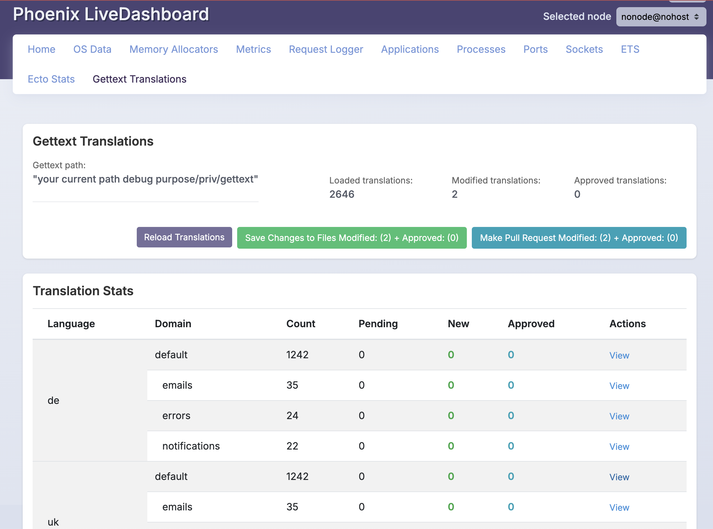
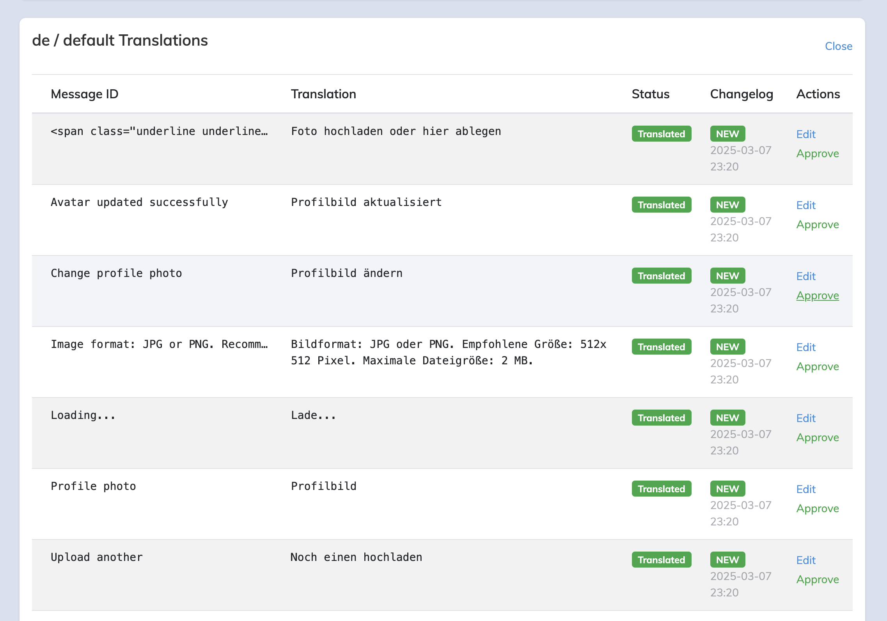

# GettextTranslator

[](https://github.com/marmend-company/gettext_translator/actions/workflows/main.yml)

**GettextTranslator** is a robust translation utility for Elixir projects that leverages advanced AI endpoints to provide high-quality translations. The library seamlessly integrates with Elixir's Gettext, enabling you to maintain the integrity of your application's messages while translating them accurately. It supports multiple AI providers, making it adaptable to your preferred translation service.

**Changelog:** See [CHANGELOG.md](CHANGELOG.md) for detailed changes in each version.  

## Important Note
Observed that regular `:gettext` will create a different structure for the translations than the `GettextTranslator` does. This create a little chaos in the translations while commiting them to the repo. 
Hack to fix it, run you `mix gettext.extract` one more time after translations are done, that will fix the structure and only new translations will be in diff for commit.

## Features

- **Multi-Provider Support:** Easily switch between translation endpoints such as Ollama AI and OpenAI.
- **Customizable Configurations:** Define your own translation persona, style, and languages to ignore.
- **CLI Integration:** Translate Gettext files directly from the command line.
- **Seamless Gettext Integration:** Automatically translate files in your Gettext directory.
- **Live Dashboard:** 
- Monitor and manage translations through Phoenix LiveDashboard.
- Detailed view of all translations with filtering and pagination
- Direct editing of translations in the LiveView
- Approval workflow for LLM based translations
- Saving changes back to PO files
- **Production Ready:** Works in both development and release environments with proper path handling.
- **Pluralization Support:** Properly handles language-specific plural forms (including Ukrainian with three forms).

#### Upcoming Dashboard Features
In upcoming releases, the full dashboard UI will include:
- Git integration for creating commits and PRs


## Example

#### List all translations in the dashboard:



#### View translations in the dashboard:



## Installation

Add `gettext_translator` to your dependencies in your `mix.exs`:

```elixir
def deps do
  [
    {:gettext_translator, "~> 0.4.2"}
  ]
end
```

Then, run:

```sh
mix deps.get
```

## Configuration
Configure GettextTranslator in your `config/config.exs` file. Below are examples using two different AI translation endpoints.

### Using Ollama AI

```elixir
config :gettext_translator, GettextTranslator,
  endpoint: LangChain.ChatModels.ChatOllamaAI,
  endpoint_model: "llama3.2:latest",
  endpoint_temperature: 0,
  endpoint_config: %{}, # Leave empty if running Ollama locally with the default API endpoint
  persona: "You are a professional translator. Your goal is to translate the message to the target language while preserving meaning and length.",
  style: "Casual, using simple language",
  ignored_languages: ["en"]
```

### Using OpenAI

```elixir
config :gettext_translator, GettextTranslator,
  endpoint: LangChain.ChatModels.ChatOpenAI,
  endpoint_model: "gpt-4",
  endpoint_temperature: 0,
  endpoint_config: %{
    "openai_key" => "YOUR_OPENAI_KEY",
    "openai_org_id" => "YOUR_ORG_ID"
  },
  persona: "You are a professional translator. Your goal is to translate the message to the target language while preserving meaning and length.",
  style: "Casual, using simple language",
  ignored_languages: ["en"]
```

## Usage

### Running the Translator via CLI
#### Translate Using the Default Gettext Folder
To translate the default Gettext folder (`priv/gettext`), simply run:

```sh
mix gettext_translator.run
```

#### Translate Using a Specific Gettext Folder
If your Gettext files are located in a different directory, specify the path:

```sh
mix gettext_translator.run path/to/your/gettext
```

### Phoenix LiveDashboard Integration (Preview)
GettextTranslator provides a web UI for managing translations through Phoenix LiveDashboard.

> **Note:** The full dashboard UI is under active development. The current version provides a basic view and API access to translations.

#### Setup Dashboard Integration

1. Add the required dependencies to your Phoenix application:

```elixir
def deps do
  [
    {:gettext_translator, "~> 0.4.2"},
    {:phoenix_live_dashboard, ">= 0.6.0"},
    {:phoenix_live_view, ">= 0.17.0"}
  ]
end
```

2. Add the GettextTranslator supervisor to your application:

```elixir
# lib/my_app/application.ex
def start(_type, _args) do
  children = [
    # ... other children
    GettextTranslator.Supervisor
  ]
  
  opts = [strategy: :one_for_one, name: MyApp.Supervisor]
  Supervisor.start_link(children, opts)
end
```

3. Add the dashboard page to your Phoenix router:

```elixir
# lib/my_app_web/router.ex
import Phoenix.LiveDashboard.Router

scope "/" do
  pipe_through [:browser, :admin_auth] # replace with your actual pipeline
  
  live_dashboard "/dashboard",
    metrics: MyAppWeb.Telemetry,
    additional_pages: 
    [existing pages]
    ++
    [
    gettext_translations: {
      GettextTranslator.Dashboard.DashboardPage,
      [
        # Use relative path, will be resolved at runtime
        gettext_path: "priv/gettext",
        application: :my_app
      ]
    }
  ]
end
```

4. For Mix Releases we need to add the gettext_translator output files to the release assets:

```elixir
def project do
    [
      app: :my_app,
      ...,
      deps: deps(),
      releases: [
        my_app: [
          ...,
          # Explicitly include translation_changelog directory
          steps: [:assemble, &copy_translation_files/1]
        ]
      ]
    ]
  end

  defp copy_translation_files(release) do
    File.mkdir_p!(Path.join([release.path, "lib", "my_app-#{release.version}", "priv", "translation_changelog"]))

    source_dir = "priv/translation_changelog"
    target_dir = Path.join([release.path, "lib", "my_app-#{release.version}", "priv", "translation_changelog"])

    if File.exists?(source_dir) do
      File.cp_r!(source_dir, target_dir)
    end

    release
  end
```

#### Using the Translation API

While the full UI is under development, you can use the Translation API directly in your application:

```elixir
# Start the store manually if not using GettextTranslator.Supervisor
GettextTranslator.Dashboard.start_translation_store()

# Load translations from your gettext path
GettextTranslator.Dashboard.load_translations("priv/gettext")

# Get all loaded translations
translations = GettextTranslator.Dashboard.TranslationStore.list_translations()

# Filter translations by criteria
pending = GettextTranslator.Dashboard.TranslationStore.filter_translations(%{status: :pending})
es_translations = GettextTranslator.Dashboard.TranslationStore.filter_translations(%{language_code: "es"})
```

### Git Integration
  Get a token from your Git provider, write_repository and api access is sufficient. As the logic is making PR/MR requests.
#### GitHub

To use GitHub as a git provider, you need to configure the following options in your `config/config.exs`:

```elixir
config :gettext_translator, :git_config, %{
    github_token: "YOUR_GITHUB_TOKEN",
    repo_url: "https://github.com/YOUR_USERNAME/YOUR_REPOSITORY",
    base_branch: "main",
    provider: "github"
  }
```

#### GitLab

To use GitLab as a git provider, you need to configure the following options in your `config/config.exs`:

```elixir
config :gettext_translator, :git_config, %{
    gitlab_token: "YOUR_GITLAB_TOKEN",
    repo_url: "https://gitlab.com/YOUR_USERNAME/YOUR_REPOSITORY",
    base_branch: "main",
    provider: "gitlab"
  }
```

### Advanced Examples
#### Batch Translation Script
For projects with multiple Gettext directories, you can create a custom Elixir module to run translations in batch:

```elixir
defmodule BatchTranslator do
  def run do
    ["priv/gettext", "lib/my_app/gettext"]
    |> Enum.each(fn path ->
      System.cmd("mix", ["gettext_translator.run", path])
    end)
  end
end
```

Run the batch translation in IEx:

```sh
iex -S mix
iex> BatchTranslator.run()
```

#### Overriding Configurations at Runtime
You might want to adjust the translation behavior without changing your config files permanently. Override settings in IEx:

```elixir
iex> Application.put_env(:gettext_translator, :persona, "Translate concisely and accurately.")
```

## Documentation
Comprehensive documentation is available on [HexDocs](https://hexdocs.pm/gettext_translator). It covers detailed configuration options, advanced usage, integration guides, and best practices.

## Contributing
We welcome contributions from the community! Please review our [CONTRIBUTING.md](CONTRIBUTING.md) for guidelines on submitting issues and pull requests.

## License
GettextTranslator is released under the Apache License 2.0 License.
